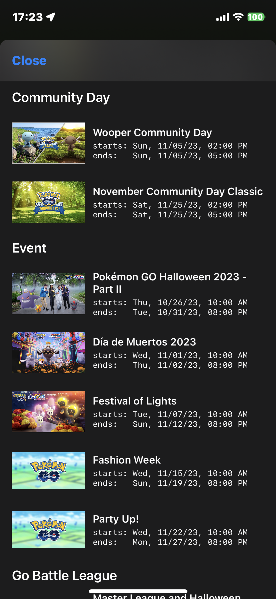
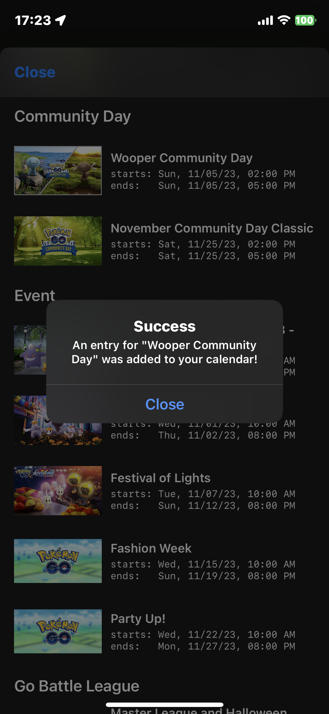
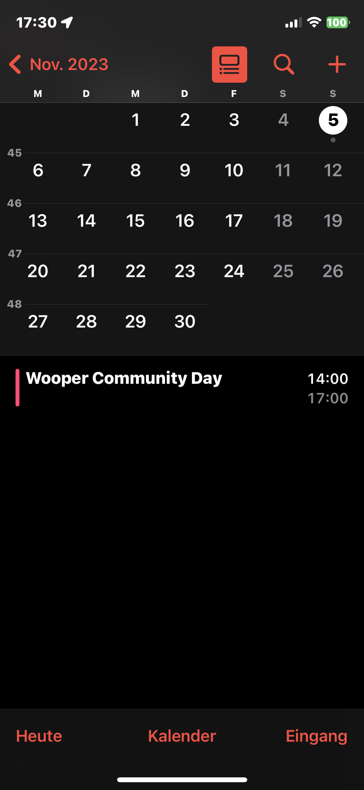
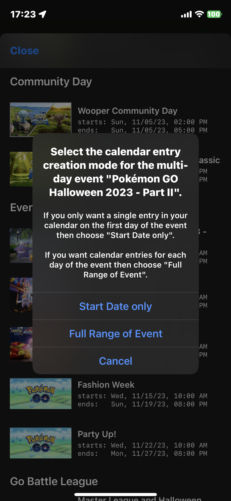
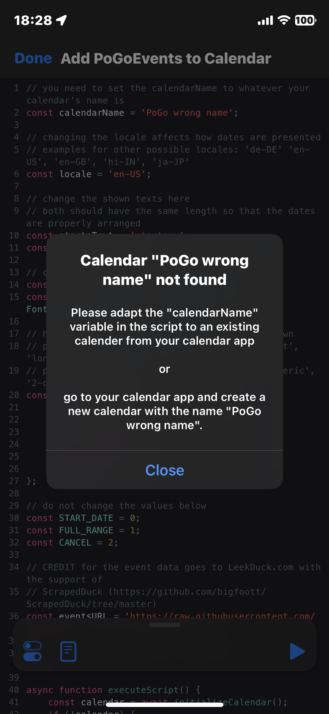
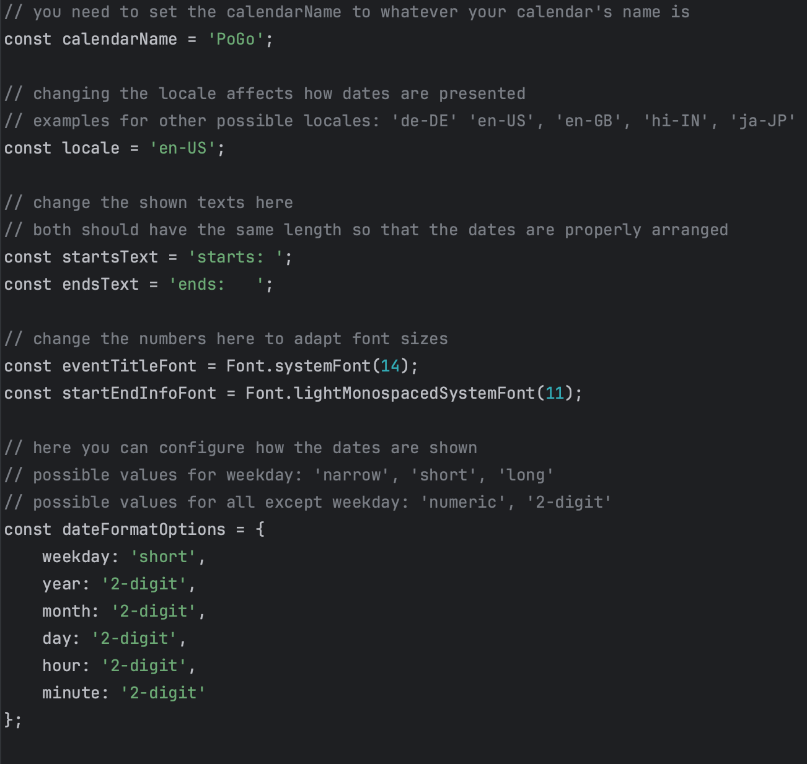

# Add Pokemon GO Events to your iOS calendar
- this script displays the current and upcoming events that exist in Pokemon Go
- users can tap on a list item to create a new calendar entry for the selected event
  - this will display the following alert 
  - when you check your calendar, you will see the created entry 
- when an event is longer than a single day then you will get asked if you want to only create a calendar entry on the first day of the event or across the full range of the event
  - 
- if a calendar entry already exists for the selected event then the old one is removed (you will not have duplicated events in your calendar)
- you will get the following alert if the calendar cannot be found 

# How to set up 
- this Script is only for Apple devices and you need to have the Scriptable app from the Appstore installed
- you can install the script itself using https://scriptdu.de or by manually copying the .js file content to a new script inside your Scriptable app
- once you have it on your device, you need have the "calendarName" variable at the top to point to an existing calendar in your iOS device
  - either you create a new calendar (inside your calendar app) with the name "PoGo" then the script works immediately
  - or you change the "calendarName" variable to whatever your preferred (and already existing) calendar's name is
- in the current version, the script is meant to be executed inside the Scriptable app (meaning there is no widget for it)

# Customizations
- you can play around with the variables at the top as mentioned in the commented lines
- 
- e.g. german people probably want to change the locale to 'de-DE' so that the dates show nicely in the german format

# Credit for the event data
- credit for the event data goes to https://leekduck.com
- thanks to https://github.com/bigfoott/ScrapedDuck it is very easy to access the data in a predefined format